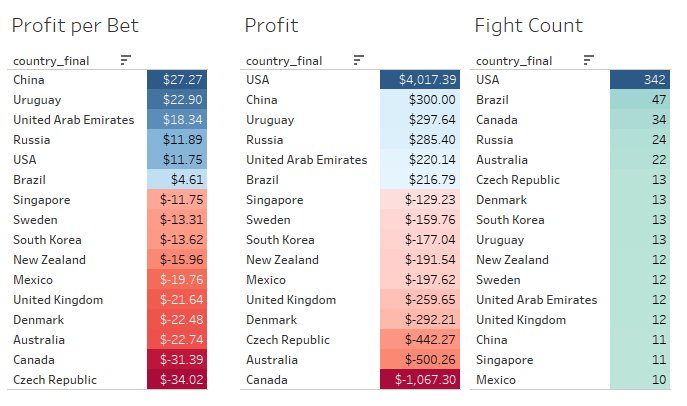

# tiger-millionaire
## UFC Fight Predictor

Tiger Millionaire (T-M) is a project whose goal is to use machine learning models to predict the winner of Ultimate Fighting Championship (UFC) fights. Not only will it predict winners, it will use the odds to predict profitable bets. The project will be deemed to be a success if we can create a model that is able to return a profit.  

***
This is a work in progress.  This readme will be updated as work progresses.

***
### Initial Steps

* The original data set comes from [WarrierRajeev's Kaggle dataset](https://www.kaggle.com/rajeevw/ufcdata/)
* I have modified this data to add extra features and remove some rows
* The models predict who will win: 'Blue' or 'Red'.  The red fighter is generally the favorite.

* Because of this I predict models that have a high true positive rate with respect to blue could be the most profitable.  Being able to predict underdog winners means more return per winning bet.
* My best model currently has a true positive rate of .57.

### Model Selection

When designing models I used a variety of techniques and grading systems to rate them.  I chose the best model by selecting the last 50 UFC events as the test set, training the models on all of the other UFC events and then seeing how the models do predicting bets.  The model that does the best when evaluated in this way is a Random Forest with around 10 features chosen based off their Pearson Correlation.

In the last 50 events this model shows a profit of $1920.  The model is more profitable betting underdogs returning $3.79 per underdog bet as opposed to $2.71 per favorite bet.  The model also picks many more underdogs than favorites, betting 285 underdogs compared to 173 favorites.

An interesting statistic is how the model does predicting fights by gender.  The model returns a profit of $13.47 per female fight, and only $.89 per male fight.

A final point of interest is how the model does by country.  Other than Russia, the model does not return a profit in any European country.  For countries that have had over 2 events it only returns a profit in Brazil, Russia and the United States.  In fact, if you were to only use the model to predict fights in the United States if would be twice as profitable.

### How we Decide what Bets to Place
To determine which bets to predict we use the classification models' built in probability method to determine the probability each side (red, blue) has of winning.  We then determine the expected value (EV) of the bet.  If the EV is positive we make the bet.  Because of the nature of gambling odds it is impossible for bets on both side to be profitable, but it is possible that we predict neither side to be profitable.  This would result in no bet.  My calculations use theoretical $100 bets.  Any number could have been used, and the results would scale.

EV for red is determined by: (Probability of Red Winning) * (Payout if Red Wins) - (Probability of Blue Winning) * 100

EV for blue is determined by: (Probability of Blue Winning) * (Payout if Blue Wins) - (Probability of Red Winning) * 100

### Acknowledgements

* This project is built off of WarrierRajeev's initial work: (https://github.com/WarrierRajeev/UFC-Predictions)
